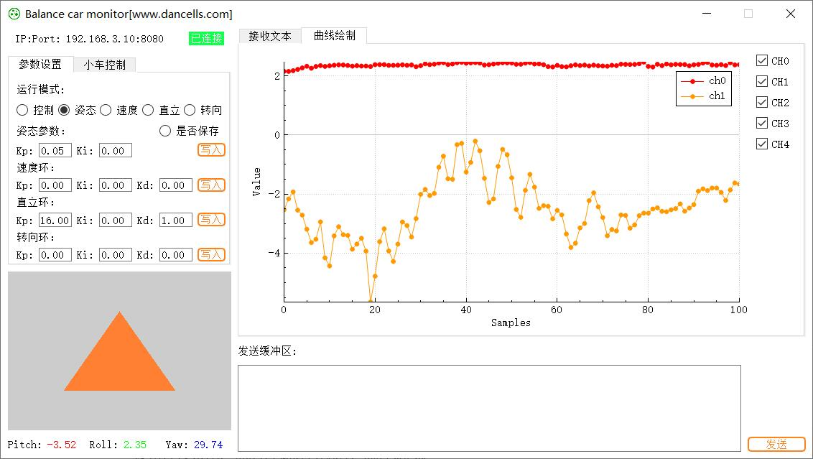
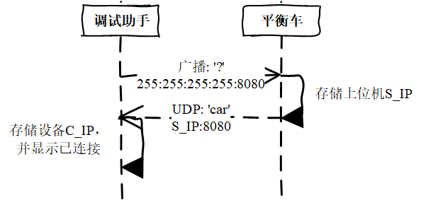

# 简介

软件功能：

- 显示平衡车运行参数：姿态、速度、电量等，OpenGL 3D可视化待开发；
- 曲线绘制；
- PID参数在线整定：姿态、速度环、直立环、转向环PID；
- 小车遥感控制。

软件界面如图所示：




# 实现方式

软件通过QT的信号与槽机制进行事件响应，主要功能实现方法如下：

- 通信：采用 `QUdpSocket` 实现。
- 曲线绘制：采用 [QCustomPlot](https://www.qcustomplot.com/index.php/introduction) 实现，使用方法可参考 [qcustomplot tutorials](https://www.qcustomplot.com/index.php/tutorials/settingup)、[csdn](https://blog.csdn.net/guo_lei_lamant/article/details/79826685)。
- 摇杆：采用 `QPainter` 控件实现，可参考[csdn](https://blog.csdn.net/weixin_42075507/article/details/102582041)。
- 3D可视化（待开发）：OpenGL，可参考[bilibili](https://www.bilibili.com/video/BV1UL411W71w?spm_id_from=333.999.0.0&vd_source=41790478e368da082da72b69c5685d53)。

详细代码已开源，可查看[Github](https://github.com/dancells/wifi-balance-car-monitor).

# 通信协议

消息结构除设备连接、发送缓冲区外，都采用 C/C++ 结构体。

## 设备连接

设备连接采用广播的方式进行配对，流程如图。




## PID参数

```c
typedef  struct{
    char fh;	// 帧头：姿态0x11, 速度0x12, 转向0x13, 直立0x14
    char is;	// 是否写入：0/1
    float Kp;	// 比例
    float Ki;	// 积分
    float Kd;	// 微分
    char ft;	// 帧尾：0x0d
}PID_message;
```


## 姿态参数

```c
typedef  struct{
    char fh;		// 帧头：0x21
    float roll;		// 横滚
    float pitch;	// 俯仰
    float yaw;		// 航偏
    char ft;		// 帧尾：0x0d
}GES_message;
```


## 信号绘图

```c
typedef struct{
    char fh;	// 帧头：0x22
    char ch;	// 通道数：1-5
    float data[5];	// 通道数据
    char ft;	// 帧尾：0x0d
}PT_message;
```


## 运行信息

```c
typedef struct{
    char fh;		// 帧头：0x23
    char eq;		// 电量
    float speed;	// 速度
    float roll;		// 横滚
    float pitch;	// 俯仰
    float yaw;		// 航偏
    char ft;		// 帧尾：0x0d
}Opt_message;
```


## 控制信号

```c
typedef struct{
    char fh;	// 帧头：0x23
    float x;	// 转向[-1, 1]
    float y;	// 速度[-1, 1]
    char ft;	// 帧尾：0x0d
}Ctrl_message;
```


## 运行模式

```c
typedef struct{
    char fh;	// 帧头：0x41
    char mode;	// 调参 控制0, 姿态1, 速度2, 直立3, 转向4
    char ft;	// 帧尾：0x0d
}Opt_mode;
```


## 发送缓冲区

原码直接发送，无结构。

